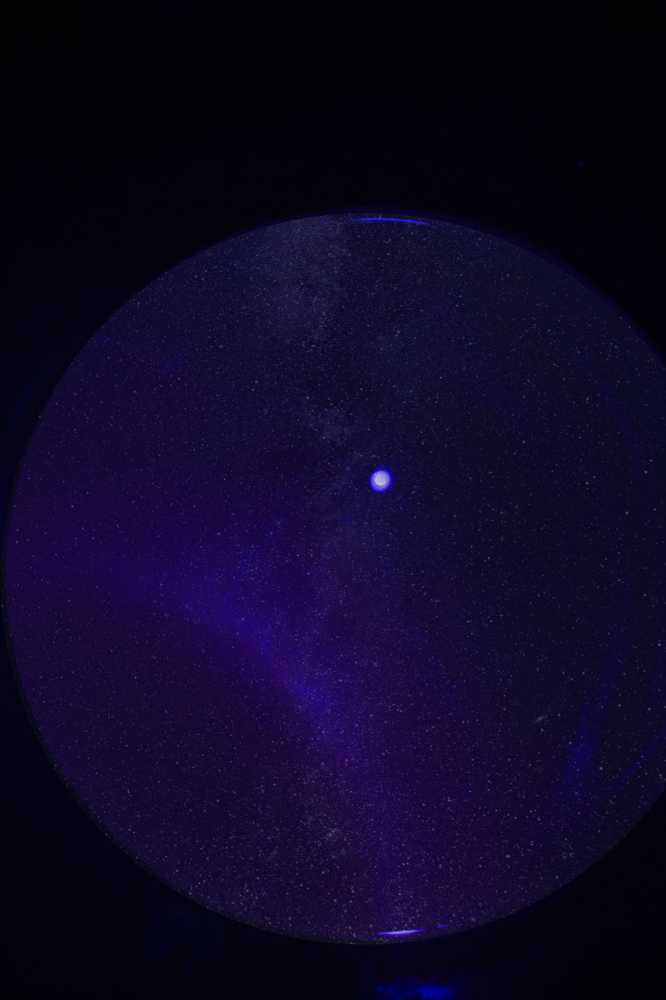
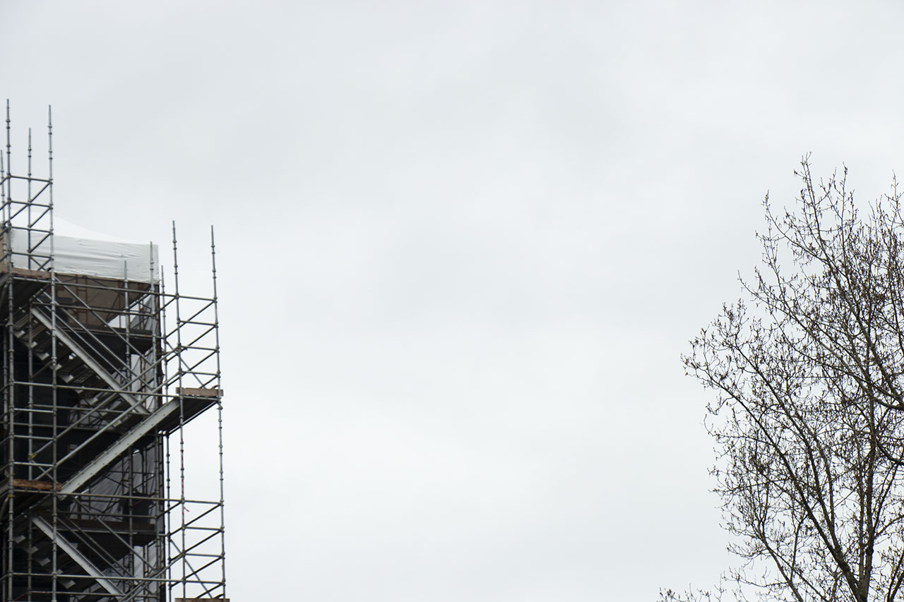
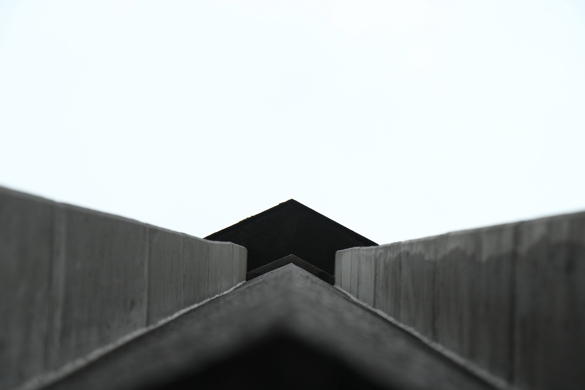

For Spring 2018, I took the ART 140: Basic Photography course, instructed by Professor Rebecca Cummins. This course had got my interest for sometime after I have first enrolled in UW since I was curious about "the secrets" to photography, such as learning about composition of a photo, the typography, the lighting, and even darkroom operations. This gave my school life some additional flavor, which compelled me to discover peculiar impulses within mundane existences.

Here are some artifacts of my work in this photography course. I am a person who fiddles with bizarre ideas, and therefore quite a few of my photo would seem other-worldly, which was what I intended to be. Though, I think I shall leave the interpretation to the viewers.

---
[[Going Downhill]]
[[Matrix Algebra]]
[[Planting Design]]

[//begin]: # "Autogenerated link references for markdown compatibility"
[Going Downhill]: <../Going Downhill.md> "Going Downhill"
[Matrix Algebra]: <../MATH/Matrix Algebra.md> "The Matrix: Failure"
[Planting Design]: <../LARCH/Planting Design.md> "Planting Design"
[//end]: # "Autogenerated link references"