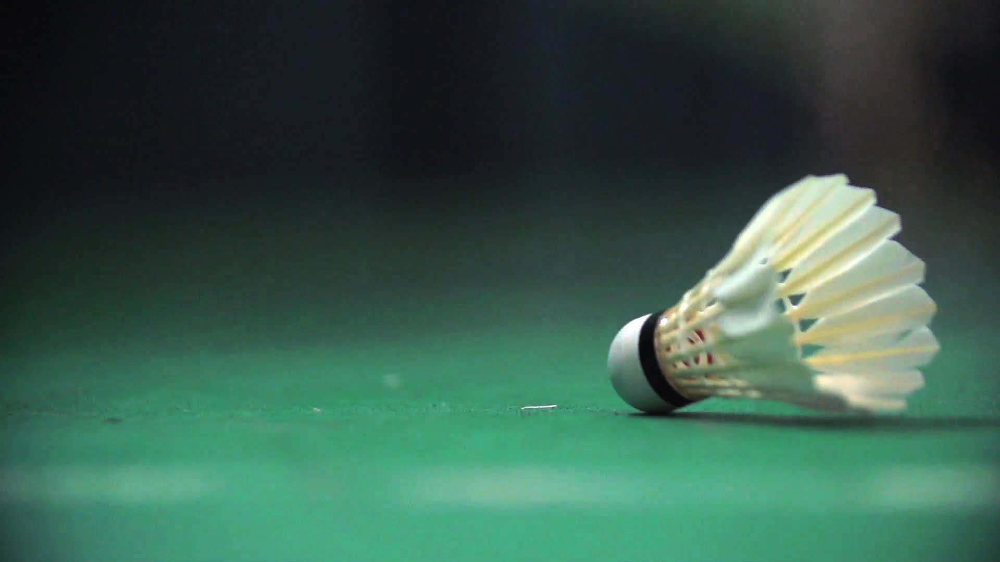
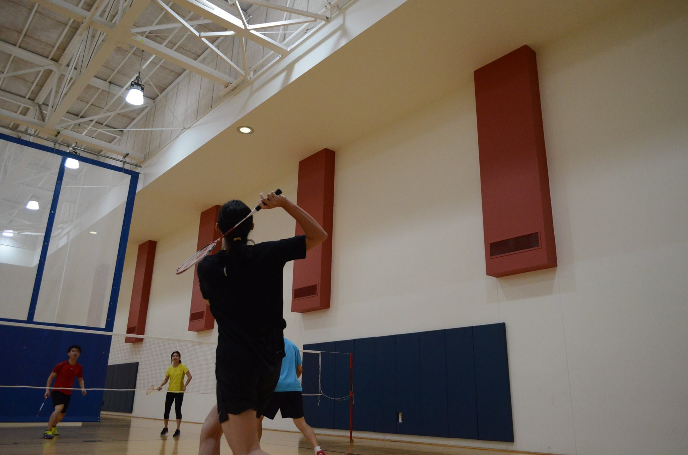

## Citius, Altius, Fortius

For obvious reasons, I need some form of exercises as a college student. So, I began searching and it was such a blessing to find that there is a Badminton Club in UW. Without a doubt, I went to find the president of the Club (Eric Eckert), and just say "Hey I want to join the club" "100 dollars for the year you say? Take my money and I'm in". Just like that, I became a member of the Husky Badminton Club. I have been to almost all the practices, and participated partly in the Mini Husky Open Competition. The people there are so friendly, and I can already imagine being a part of this Club for the entire four years in UW.

---
