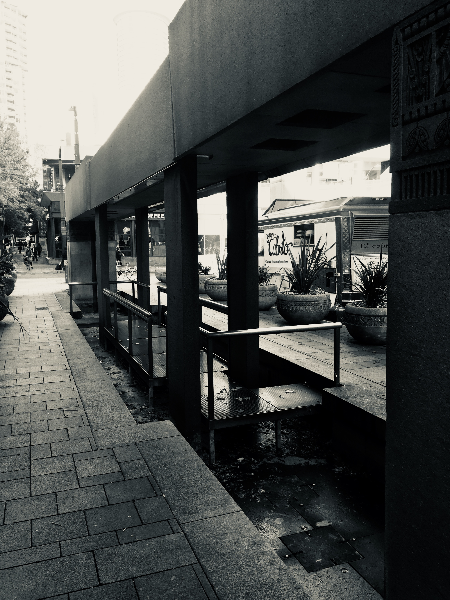

## ART. TECH. MAN.

While my intended major in UW is INFO, it does not prevent me from being interested in Landscape Architecture.(L ARCH 212) At first, I imagined it to simply be "drawing buildings"; it's not. It is an interdisplinary field, which combines and elaborates upon all sides from engineering, humanity, aesthetics, politics, and etc. We've done readings, movies, charrettes, and some other approaches to grasp the diverse perspective on current Architecture/Landscape Architecture, different methodologies, ideologies behind urban developments, and ultimately how the keywords "sustainability" and "affordability" can play in harmony with the social/political/cultural diversity.

Here we visited Westlake Park down in Westlake District. We were taking photos to cite things that we find interesting and plays both an aesthetic and security role for the public. This stone waterfall intrigues me a lot when I found it fits well with the park, the pavement while providing safety for inner infrastructure.

It might seem like a exaggeration, but this class field trip enables me to be more attentive when considering simple designs around our lives. In this case, people walk by Westlake Park everyday, but few ever questioned why there is a children playground, and why it's positioned like so. Based upon my envision, the children's playground is displaced at this corner for two specific intentions: first, a place for children to play around without consuming too much space; second, a calculated angle it forms with the only entrance of this public space limits the movement of vehicles so that in case of aggression, less damage can intrude inward into buildings.

---

[[Java]]
[[Badminton]]
[[Memoir Reflection]]
[[The Foothill]]

[//begin]: # "Autogenerated link references for markdown compatibility"
[Java]: Java "Java"
[Badminton]: Badminton "Badminton"
[Memoir Reflection]: <Memoir Reflection> "Reflection Paper"
[The Foothill]: <The Foothill> "Autumn Quarter Reflection"
[//end]: # "Autogenerated link references"