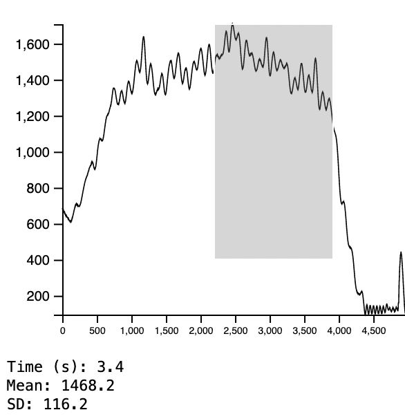

# Experiential Learning 2

## Multi-User Portal

### Reflection
It was an excellent learning experience working with Dr. Brian Cohn on this project. It has contributed significantly to my understanding of web development and service design principles. In the past, I often remained in the back and performed assignments on demand, such as I did for my research at the iSchool Gamer Lab. This time, as a full-stack developer, I partake in critical decisions that affect client experiences, such as service usability and stability. During the pandemic, a surge of needs in electronically assisted healthcare arose, and such affordances became critical for health professionals to assess patients' conditions with ease. Aside from generating design choices, I am responsible for their implementation, resolving unexpected behaviors, and leading the team to keep the progress going. 

I have demonstrated my efforts in leadership by constantly building a vision of this project for the team and translating such vision into sustained development while working with Brian and various unnamed collaborators. The responsibility of a leader became apparent to me when goals started to get blurry, and there were no specific assignments. I had to take the initiative in establishing measurable objectives, identifying tasks, and setting deadlines for completion. What was especially difficult was maintaining a level of systems thinking as I tend to drift into specific details of an implementation (such as choosing a web framework), which would've disrupted the overall organization of the project. Through extensive self-reminders and communications, I have become more resilient as I learned to notice such potential detours and adjust the scope of goals to keep things on track.

My training in strategic planning and consistent feedback exchanges have also sharpened my ability to build productive relationships with others. The quick discussions with Brian were particularly constructive as I was essentially learning how to lead by working with someone who already leads in both the professional and academic context. At times, observing his response to ambiguity and how he follow-through with plans helped me improve my own. 

The experience of working on this web portal that aggregates and visualizes diagnosis info for health professionals leaves an impactful mark on my trajectory in both the tech industry and academia. As I aspire to lead as a developer and researcher in the field of Computer Science (currently Computer Vision and Computer Graphics), this project is a milestone for me to achieve my fullest potential and lead effectively. I am eager to learn more about ways to keep myself motivated (especially during such depressing times as the pandemic continues) and seek to positively impact the field of tech as I connect with others and lead better as I learn.

### Summary

I worked as a lead developer in a full-stack multi-user portal project where we built a better portal for medical professionals to process patient information. I was responsible for ideation, problem-solving, implementation, and some strategic planning. I partook in this project because I want to build a skill set that allows me to lead a software engineering team and push myself out of my comfort zone.