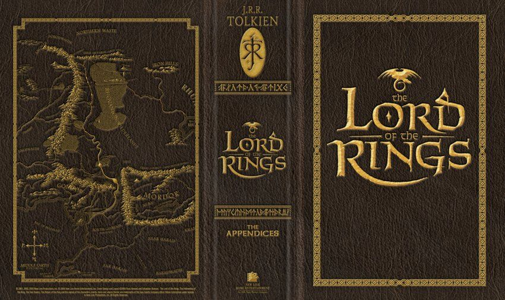

Imagine a course name that would capture your attention at anytime. When your mind wanders away and feels unattentive, there is going to be some keywords that immediately excites you, right? For me, it is the course Honors 211 D: Analyzing Invented Languages: from Elvish to Dothraki. In fact, many student in this course found this description captivating. Elvish? Dothraki? Invented Languages?! Man, this is going be a blast, many of us thought. Without any doubt, this course gave me the wildest ride with conlangs.

In this course, we analyzed the origin of invented languages, compared them against natural languages, also learned to dissect conlangs into separate parts for analysis, such as the lexicon, the grammar, the phonology, as well as how a conlang helps to bind communities, or becomes embodied in fictions. The best example we went over was _The Story of Your Life_ by Ted Chiang, and the movie _Arrival_ was an adaptation of this piece. This course made me truly acknowledged how marvelous language is to our lives, and simultaneously contemplate a philosophical question: [Do we think to speak, or do we speak to think?](https://en.wikipedia.org/wiki/Linguistic_relativity)

The following is a Linguistic Memoir in which I recall and discover all the influences language has to me in the past.

## Artifact

[Linguistics](https://github.com/QuantumEPR/z-en-kb/blob/master/pdfs/linguistic.pdf)

---

[[Landscape Architecture]]
[[Logic]]
[[Landscape in PNW]]

[//begin]: # "Autogenerated link references for markdown compatibility"
[Landscape Architecture]: <../LARCH/Landscape Architecture> "Landscape Architecture"
[Logic]: ../PHIL/Logic "Logic"
[Landscape in PNW]: <Landscape in PNW> "Escape"
[//end]: # "Autogenerated link references"