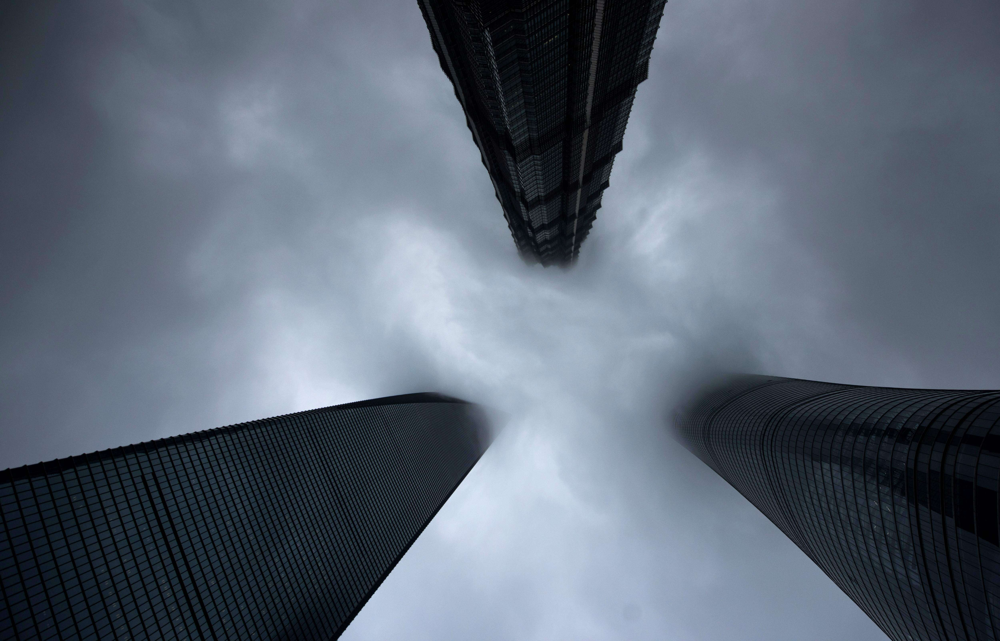
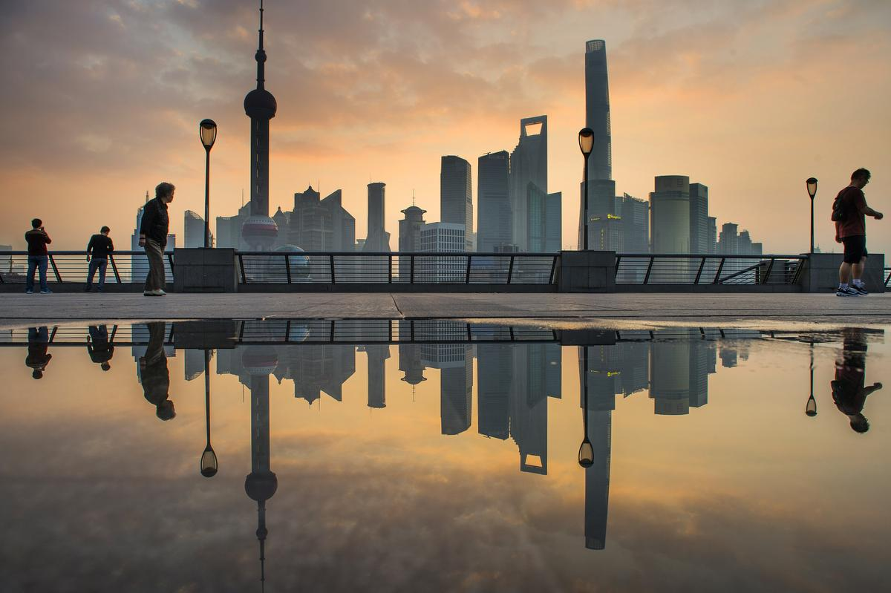

## HONORS 345 - A Memoir

### Higher

In Shanghai, we lived high. For maximizing the usage of the land, and a population of twenty-four million within this city, people ought to explore the possibilities above the ground. If you were to visit a modern Shanghainese home in downtown Shanghai, it would not be odd to find yourself fifteen to thirty floors in the air. Stepping on to the balcony, a tiny part of Shanghai unfolds beneath, presenting linkage towards the past and future. They speak of the very essence of this place, the utmost nature of the people, the intertwining of history and future, which unravels into a rapid spin like a cultural blender.

I have always wondered about viewing the city from above. Our apartment had two balconies, one to the south, and the other to the north. They were two different lenses to see the same fantasy. Approaching the south lens, I could clearly see a skyline made of buildings. On the east side of Huangpu River, a futuristic style of skyscrapers carved the land, like metallic bamboos poking out of the ground, thrusting through the clouds. The west side, however, flourished with 1800s European style architecture, ornamented with fabulous arches and details symbolizing the origins of their architects. Was it intentional? Or was it just a beautiful accident? I had no way to tell. Nevertheless, this scene reminded me that people have a history to tell, and a future to endeavor.

Yet this lens was not the one I was interested in. The lens on the northern side, oddly, was I rest my mind upon. Not that because it was any special, but because it was indifferent. Standing on this balcony, you would find yourself surrounded: the other gated community apartments just across the street, and in fact, across any street, piles around so that you could never see the horizon. All that was visible had been limited to a tiny scope of the T-intersection next to our gated community, the small plaza beside the intersection, and the community garden directly below. Why would this view be captivating, you may ask, for this scene seems almost pathetic compared to the grandeur masterpiece presented in the south? My reason would be, you could never experience the reality of the city through the glorified version of the south.

Looking down upon the pedestrians and cyclist on the road, you would realize how insignificant humans seem. People appear like miniature Lego figures, moving between the shadows of buildings. The buildings, to me, a child at that time, were the titans, supervising the area with utter silence. They never moved, which had been a relief for me. However, these were not the only things you could experience on the northern balcony. For me, the most frequent feeling was to jump off.

I wanted to jump off, but not by any means of suicidal thoughts: it was the excitement, the
excitement of imagining being set free to a celestial calling. I used to take a box of facial
tissue to the balcony, took one piece out, and set free into the wind. The tissue first fall, but once a breeze had picked it up, it went with the flow, onto a magical journey. Watch, it flew that way! The Zephyr became a tempest, carried the helpless tissue high above, swirling madly in a circle as if the wind has found a partner to waltz. They danced, wiggled across the view, seemed like aiming for the roof of the building twenty meters away, or they were coming back this way, or they were going down… The tissue and the air kept performing, hypnotizing me with their unpredictable rhythms. They seemed so liberated. Lifted from the ground, they were never bonded, never escaped. I wished I could be the tissue so that I could go on a mysterious trip passionately, full of wonders and possibilities. Imagine the weightlessness, the ability to explore without limits of the human condition, to jump off someplace and take a ride to wherever it took me, oblivion, or heaven, all the same.

However, I cannot. Living in the city was determined to be grounded, to be realistic, to be occupied by all the fast-paced activities. The community was distant, since there was not enough communication to stay connected. The city was detached, functioning without emotion as if humans did not inhibit it. The history was sculptured, the future was projected, but underneath the deceitful façades, something was dead inside. We were living on the edge, the edge of the city, the pinnacles of our own prison. As a Shanghainese and more importantly a Chinese, I cannot stop thinking about the stresses people here had to bare. **338.49%**, that’s the mortgage as the percentage of income in Shanghai. **1477.16\$**, that’s the price per square feet to buy an apartment in Shanghai’s City Centre. **1339.24$**, that’s the Average Monthly Net Salary in Shanghai. **9.4 Million** students in China attended the National Higher Education Entrance Exam in 2017. As the statistics kept going, you realized that this was never going to be easy. I realized that I would have taken this path if I did not have alternatives. Yet, I did. To seek a new adventure then the seemingly predestined one, one had to sacrifice something else as a tradeoff. Again, I did. Taken the opportunity to seek a different life, I was caught by the vortex of life, swirling down the drain, out of the China Basin, and across the Pacific in the US. I was there to study, to achieve something more, to see the world beyond the horizon.

Despite, I was there with nothing other than money and myself. No friends to take on, no family to follow around, no memories to keep me feel belonged. I went ahead. No turning backs, no goodbyes, no time to waste, I hopped aboard the plane, with the most naïve enthusiasm a thirteen-year-old could have. There were still years to come for me to know what the decisions I had made had done for me.

---

### Strange beginning of a familiar journey

It all started when my Chinese friends were chatting casually after school. I was trying to nap on the dining table using my arms as pillows, while a few meters away a bunch of Chinese were having a passionate discussion over their vacation plans. Face flat, resting on my arms, I was dozing off. A few words caught my attention: Going back to China. Summer vacation was so close, and since we were graduating this year, it would be sooner, like in two weeks. Of course, I would be going back to China whatsoever because after graduation I would have nowhere to go if not Shanghai, China. I wondered if there was any reason other than that. I had asked these Chinese classmates why would they go back and they looked at me like I was an alien. Cold wind swirled in every time students went outside to be picked up. Still covered in snow, branches wiggled crazily outside the window as wind blew through, like a wave to say goodbye.
I never needed to plan for my journey back to Shanghai. I had known the places in Shanghai pretty well so that no assistance would I require to navigate in it. But if it was like my friends asking what I planned to do after I got back, I had no idea. I couldn’t think of what I should plan to do but lost within the ethereal whispers of “Shanghai” in my mind. This word seemed so distant, yet so eminent; so strange, yet so familiar.
Ting!
A message popped up on my phone. “Time to go home.” Sent by my host mom. I grabbed my bag, jabbed my roommate so that he knew it was time to go, and went outside into the brisk wind.
“Time to go home.” I told myself again as I hopped into the car.

---

I never truly wanted to be back. My mom said it was a mistake, to let me out into the world at such an early age, which hampers my empathy for others and being apathetic to what people usually care. I would agree, but I liked it. People have different characteristics, and mine had done me good as well as bad. I had already arrived, and when I finished checking with the officer at the custom, I can already smell the air, the air of Shanghai, which to me is filled with a hypnotizing aroma. The skyscrapers, stood like metal bars, overarching everything on this land with indifference, while people gotten lost in eye captivating entertainments. Shanghai was a place where people who didn’t belong to was more welcomed. People came here for jobs, for a new life, for opportunities, for whatever reasons they found unacceptable in their origins, and they could test themselves out in this experiment ground. Moreover, whoever dominated in the head of the fashion, in all different kinds of fields, got to continue pursuing their lives. Years ago, the small apartments next to our confined neighborhood covered about 5 to 6 blocks of range. Senior people lived in these traditional Chinese apartments. Artisans and small businesses occupied the front façade. These apartments were not the typical ones you could expect from the US but like the more carefully constructed shanty towns, with tiles colored in dark gray or mahogany, and the shabby, whiteish brick walls. People had been living there, surviving with minimal wages. Now they were gone. Gone from every aspect, the physical structure had been crushed to dust, the landlords and the renters had vanished, just as they had never existed before. The place became a temporary parking lot before the redevelopment. For me, they were gone for good. I believed, that they had reasons to leave. A legitimate reason for themselves, and they should leave no matter what because they really degraded the appearances of the city. Looking at the ashes and gravel, I was pleased. It’s cleansed, I think. The sun shines upon the broken walls, the “拆”(Demolish) character glowed in a clear, crimson color, as if the place were pristine.

### Fast paced laziness

I have plenty of time to waste. Filled with boredom, I got up according to the typical morning schedule my family had, and I sighed and yawned. I went to finish brushing my teeth and caught an ephemeral hint of incoming heat. The sunlight reflecting from the tiles of other buildings seems way too bright. I spat out the bubbles and foam of the toothpaste, gurgled a bit, and went to the dining table.
The breakfast was quiet, except that my father mentioned whether I had any plan for the day. I shook my head hesitantly, and started to think about the things I could do. Chewing some preserved vegetables with rice porridge, my mind was set to fly; images blinded me like snow. The various screeching sounds of electric scooters, the constant banging from the construction sites, the people on the pedestrian path walk as fast as a race and adults flooding off buses and subways like a dam just had a flood discharge, and the Shanghai Oriental TV Tower radiating different lights piercing through curtains, which I had to get used to again. It was so irritating. The sudden flash of lightning on skyscrapers, followed by the cracking roar of thunder, then the inevitable rain drops was splattering on the ground in weird Prestissimo rhythms, like the sky has pointed a machine gun to this city, shamelessly spraying through the cloud. The sizzling sound of egg frying among the breakfast shops, and the people jaywalking across the street just for their favorite breakfast place.
I had known all of these. I could wake up and tell you all these details of the city, yet having no excitement whatsoever about coming back. Recovered from the dazzling daydream, I have decided my plan. I had lost something, something that made me feel like I belonged, and I was going to take it back.

### Ancient Sunshine

My grandparents also lived in Shanghai. Hongkou(虹口) district, Donghanyang(东汉阳) Rd, their apartment was settled roughly one block away from Huangpu River. The blocks of old shanty houses had been mown down years ago, and the oldest block had almost finished becoming a new shopping center with a high-rise office building. Wall tiles embraced a glassy frosted texture, polished with delicacy, as if another attempt to promote the vibrant nature of this city. Though the reinvestment was convenient for the nearby households and the construction induced a new subway station only 100 meters away, my grandmother was not that pleased.

> “How do you feel about the new shopping mall?” I asked.

“I don’t really like it.” She responded.

> “Why? You don’t have to walk so far to purchase food every day. All the things you may want to buy is provided in
> such close quarter.”

“It’s not about the convenience.” She said. “The building obstructs the sunshine during half of the day. I cannot
dry the washed clothes anymore…”

> “But you can use a dryer---"

“No. No dryer. Dryers are not good, you know. I don’t believe these machines. They are not natural. The “moisture”
(Traditional Chinese Medical term) is still within the cloths, and that can damage your health if you do not dry the
cloths using direct sunlight. Also, the Fengshui(风水) is not perfect anymore…”

> “I thought those were superstitions…” I tried to interrupt.

“No, they are not. Listen, kid, this is knowledge from our ancestors… Your young generations are so arrogant on
accepting those truths. Let me give you some examples…” Staring at me, she was questioning my authority on cloth washing knowledge.

> “Alright.” I shrugged.

After a few minutes of “lecturing,” I came out of the conversation tired, my grandmother pleased. Our generation had not been introduced well to these ancient wisdoms, thus it’s difficult to understand when our scientific knowledge fell out of tune with these. I guess after all, this was a part of my culture. Knowing them probably can compensate a bit for the belonging I longed for.

It was five o’clock in the afternoon. The sun’s last ember was glimmering from the west, bouncing back from the huge glass panels installed on the buildings, flaming its last glory of the day. The beeping sound of cars and electric scooters became more and more frequent, signifying that rush hour had come. Further away, a distant honk of horn attracted my attention. As I walk out to the balcony, I saw the good old Bunk, along the sides were all the foreign buildings Europeans built before WWII. A ship docked at the pier, the water of Huangpu River glaring, as if it were liquid sunshine. In an hour, my parents would be back for dinner at this house. There was a sudden warmth in my heart, I did not know why, but I felt it had to do with the feeling I had lost. Glancing over the river, I waited for the TV tower to turn its colorful vibe on.
