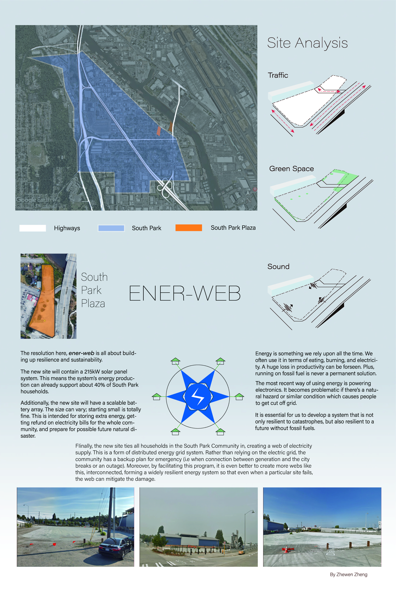
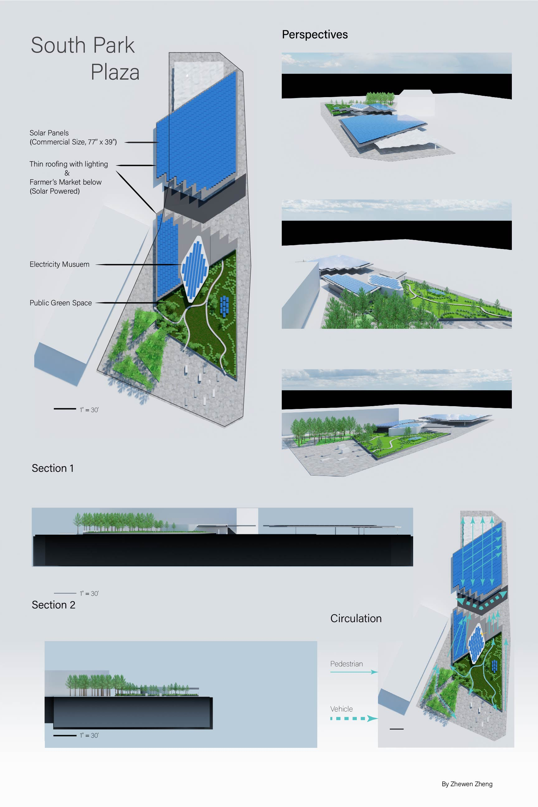

# Gut Feeling

I guess I have no particular reason to take this course. It was just gut feeling that drove me into enrollment. It was fun, however; being the only one who had no serious intention in pursuing a career in Landscape Architecture, I met many others, coming from different experience levels, trying to learn and build a portfolio that would pave their way into the LARCH/ARCH department. This course gave me a basic understanding of how landscape architects work on various elements of a project (i.e. design intent, context map, site analysis, cross-sections, rendered perspective, etc.) My final project was an attempt to redesign South Park Plaza as a resilient landscape. As one might see, my design has a lot of emphasis on energy efficiency.

---

[[Logic]]
[[Constructed Languages]]
[[Landscape in PNW]]

[//begin]: # "Autogenerated link references for markdown compatibility"
[Logic]: ../PHIL/Logic.md "Logic"
[Constructed Languages]: <../HONORS/Constructed Languages.md> "Constructed Languages"
[Landscape in PNW]: <../HONORS/Landscape in PNW.md> "Escape"
[//end]: # "Autogenerated link references"