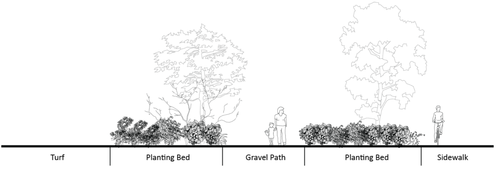
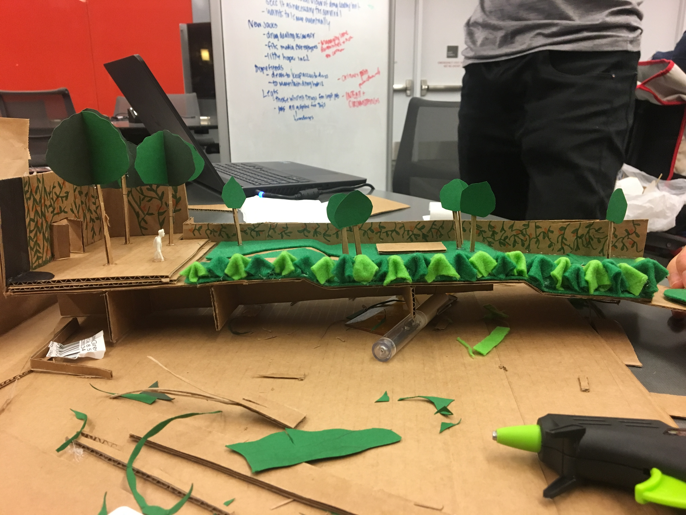
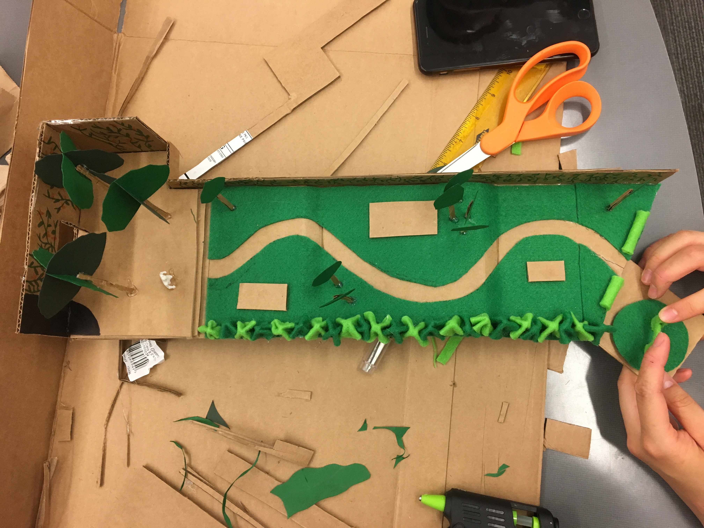

We human beings have lived with plants for a long time. Plants provide us oxygen, consume carbon dioxide, and serve as a dominant food source. But plants actually give us much more than we thought before. In the course L ARCH 322: Introduction to Planting Design, we get to learn how to identify different spaces that creates desirable environment for people to live in, what kind of plant can convey what kind of presence to people, and through what design could human and environment coexist.

Here are some pictures of our group building a reimageined model for the courtyard next to the Henry Art Gallery on Campus. In this small site, we have honey suckles creating a barrier between the traffic and this space, some paper birch trees for overhead shading, and spaces for outdoor art installations.

[[Photography]]
[[Matrix Algebra]]
[[Going Downhill]]

---

[//begin]: # "Autogenerated link references for markdown compatibility"
[Photography]: ../ART/Photography "Photography"
[Matrix Algebra]: <../MATH/Matrix Algebra> "The Matrix: Failure"
[Going Downhill]: <../Going Downhill> "Going Downhill"
[//end]: # "Autogenerated link references"