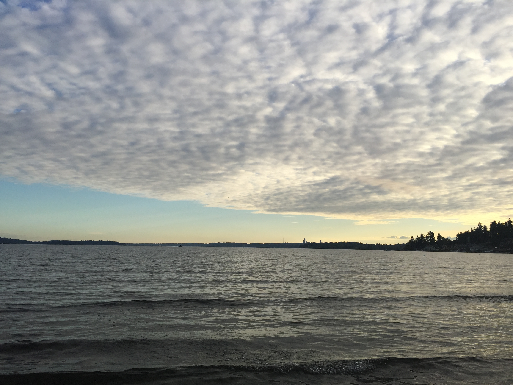

Before I took this class, I did not have a specific approach to writing papers. Though I had
studied AP English Language and Composition in high school, the rhetorical analysis certainly does not help. So, I started my writing process by doing random flashbacks in my head. Sometimes I lie on the bed, sometimes walking aimlessly, just to bring myself into a tranquil state, where I can dig deep down my well of consciousness, to search for the past and the emotions accompanied it. This process is unbelievably enjoyable: I can be simply wandering in my casual daydreams (which is what I do all the time,) be able to pick up pebbles of forgotten memories and become so relieved as I put these images down into words. Moreover, I do deliberate imitations of the authors we have read, like Tobias Wolff and Michael Ondaatje, and I find their techniques masterful and improve my writings dramatically. It’s also amazing to see how the themes of “travel” and “memoir” fit so well
for me. As an international student who studied high school in the US, I was constantly traveling, to the point of I became a traveler who cannot identify a home anymore. The complexity of my life has always been an unspoken factor, and I had never been prompted to write about it in detail. I do not talk that much, especially when I start to recall the past, and writing the past gives me the platform where I will find redemption.

For revisions, I was really glad that I got to work with Sarah Cooper and Amber Weese. Both helped me to explore the possibilities within my stories, and by simply talking to them, explaining the convoluted emotions I had kept inside, I found there was much more I could talk about. Backstories were important, and I understood that people did not want to be left disoriented without any clue. Thus, I went a bit further back in time, just to make the beginning more subtle and welcoming, so that the stories were somewhat ordered. Amber told me her knowledge about China due to her boyfriend and suggested me to include characters in my piece. She also recommended me to take in the differences I found between Shanghai and the US. Susan and I had a talk about what could I introduce into the piece, and we discussed incorporating a temple visit, (although never happened in the actual piece). She advised me to bring more background, which I think is something that did make my stories more engaging. Revisions were not that painful. I had some moments where I had the feeling of “I wrote this, I don’t want to delete it,” but when I did press that delete key and reorganized this pile of information, the result flowed pretty well. To make the connections between paragraphs and descriptions clearer, I read through the gaps I need to weld together and started to fill in the necessary transitions I captured in my thought process. Eventually, I got to a point where the piece looked like an Ondaatje collage writing. At last, for naming the section titles, I simply skimmed at the section, wrote down the vocabularies I had in mind and pieced them together. This worked for me because the titles were exactly how I feel about those events.

After all, I cannot resist but say, thank you. This course was just fantastic.

More specifically, I shall say that this experience can bring me hope out of most dreadful nights.

Thanks to everyone in this class.

I feel blessed to learn in this place.

## Artifact

[[Memoir]]

---

[[Badminton]]
[[Designing Future]]
[[The Foothill]]
[[Java]]

[//begin]: # "Autogenerated link references for markdown compatibility"
[Memoir]: Memoir "Memoir"
[Badminton]: Badminton "Badminton"
[Designing Future]: <Designing Future> "Designing Future"
[The Foothill]: <The Foothill> "Autumn Quarter Reflection"
[Java]: Java "Java"
[//end]: # "Autogenerated link references"
